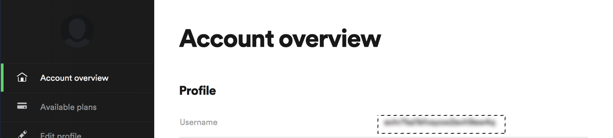
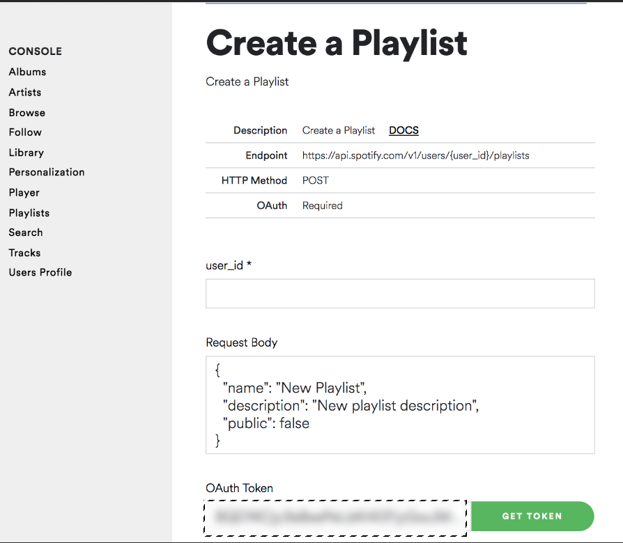

# Soundcloud-to-Spotify Playlist Converter
A simple script that takes your Souncloud playlist, and generates a Spotify playlist.

## Technologies
* [Spotify Web API]
* [Requests Library v 2.22.0]
* [Selenium v 3.141.0]

## LocalSetup
1) Install All Dependencies   
`pip3 install -r requirements.txt`

2) Get your Spotify User ID and Oauth Token From Spotfiy and add it to secrets.py file. You can add the souncloud playlist you are trying to convert.
    * You can get your User ID by Logging into Spotify and going here: [Account Overview] and its your **Username**
    
    * You can get the Oauth Token here: [Get Oauth] and click the **Get Token** button
    

4) Run the File  
`python3 create_playlist.py`   

## Troubleshooting
* Spotify Oauth token expires real quickly, If none returns throughout all the list comes up, then this probably means that the token has expired. Just request a new one and you'll be good.

   [Spotify Web API]: <https://developer.spotify.com/documentation/web-api/>
   [Requests Library v 2.22.0]: <https://requests.readthedocs.io/en/master/>
   [Account Overview]: <https://www.spotify.com/us/account/overview/>
   [Get Oauth]: <https://developer.spotify.com/console/post-playlists/>
